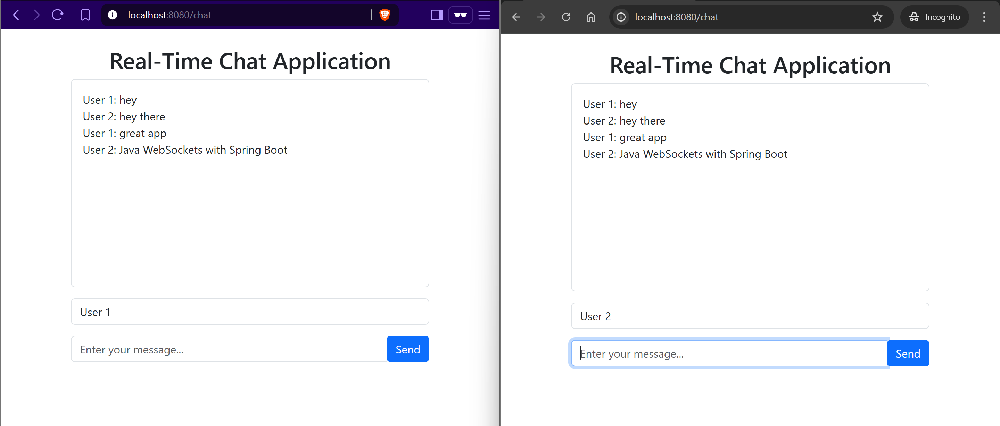

# Real-Time Chat Application

A simple real-time chat application built with Spring Boot and WebSocket technology.



## Features

-   Real-time messaging using WebSocket/STOMP protocol
-   Simple and intuitive user interface
-   No database required - messages persist only during session

## Technology Stack

-   Java 21
-   Spring Boot 3.4.6
-   Spring WebSocket
-   Thymeleaf for server-side templating
-   SockJS and STOMP.js for WebSocket client
-   Bootstrap 5 for styling

## Project Structure

-   `com.chat.app.config`: Contains WebSocket configuration
-   `com.chat.app.controller`: Handles HTTP and WebSocket message endpoints
-   `com.chat.app.model`: Data models for the application

## Getting Started

### Prerequisites

-   JDK 21
-   Maven 3.x

### Running the Application

1. Clone the repository
2. Navigate to the project directory
3. Run the application using Maven:

```bash
./mvnw spring-boot:run
```

4. Open your browser and go to: [http://localhost:8080/chat](http://localhost:8080/chat)

### How to Use

1. Enter your name in the top input field
2. Type your message in the bottom input field
3. Click "Send" to broadcast your message to all connected users

## WebSocket Endpoints

-   `/chat`: Main SockJS connection endpoint
-   `/app/sendMessage`: Endpoint to send messages
-   `/topic/messages`: Topic where messages are broadcast

## WebSocket Configuration

The application is configured to use a simple in-memory message broker for message broadcasting. Cross-origin requests are allowed only from `http://localhost:8080`.

## Development

To modify the application, you can start by exploring these key files:

-   `WebSocketConfig.java`: WebSocket configuration
-   `ChatController.java`: Message handling
-   `chat.html`: User interface and client-side scripts
